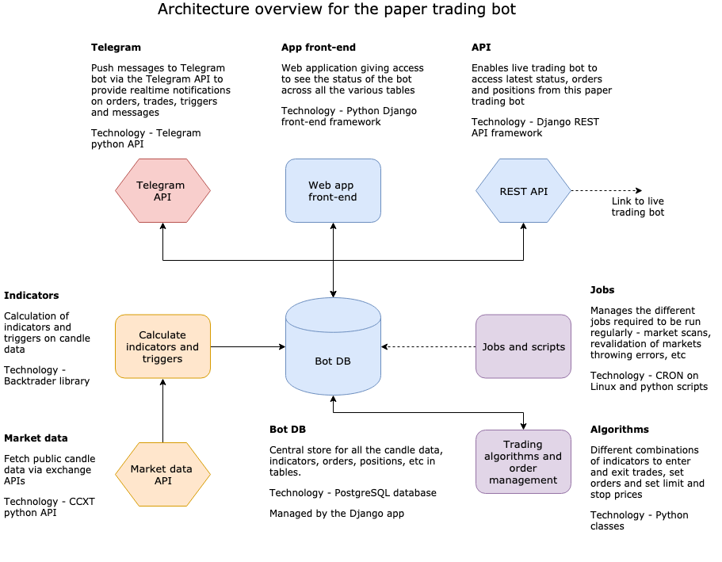

# Features for Freqtrade

## Project Abstract
Freqtrade is a free and open source crypto trading bot written in Python. It is designed to support all major exchanges and be controlled via Telegram. It contains backtesting, plotting and money management tools as well as strategy optimization by machine learning.

Features:
-   Develop your own Strategy in python, using pandas
-   Download historical market data
-   Backtest: Test your strategy on downloaded historical data
-   Optimize: Find the best parameters for your strategy using hyperoptimization which employs machine learning methods
-   Select markets you want to trade on
-   Run: Test your strategy with simulated money (Dry-Run mode) or deploy it with real money (Live-Trade mode)
-   Control/Monitor: Use Telegram or a REST API (start/stop the bot, show profit/loss, daily summary, current open trades results, etc.)
-   Analyze: Further analysis can be performed on either Backtesting data or freqtrade trading history (SQL database), including automated standard plots, and methods to load the data into interactive environments

## Project Relevance
This project would provide experience working in small teams to modify an existing open-source program. Contributing to the freqtrade codebase requires documentation with every new feature pull request and new code must be covered by in-depth unittests. Practical experience in using modern software development tools and performing these tasks as a team is a key skill of any professional software developer. Additionally, this project utilizes some of the topics covered in this course to provides its features, including: multi-threading, code optimization, on-the-fly coding, and access to database.

## Conceptual Design
To contribute to the freqtrade codebase as a beginner, I would like to resolve some of the issues labelled as "good first issues". For example, I could add the ability to add a custom fee rate during dry-run trading. By default, this value is assumed to be the exchange's default fee for trades (e.g. 0.1% for binance), but this option would allow for more consistent testing of new experimental strategies in dry-run. Another feature could be adding a simple webhook and/or telegram notification when an order is filled, or editing the telegram buy message once it is filled.

## Background
<https://github.com/freqtrade/freqtrade>

To run the freqtrade bot, I opted to enable the WSL 2 feature and install Docker on my Windows machine. Using docker-compose in the Ubuntu terminal from the Microsoft store, I pulled the freqtrade image and launched the bot with `docker-compose up -d`. Refer to <https://www.freqtrade.io/en/latest/docker_quickstart/> for a more in-depth instructions.

To configure a development environment, use the provided DevContainer. This will install all required tools for development, including `pytest`, `flake8`, `mypy`, and `coveralls`. For this, I used VSCode with the Remote container extension. This gives the ability to start the bot with all required dependencies without needing to install any freqtrade specific dependencies on your local machine.
